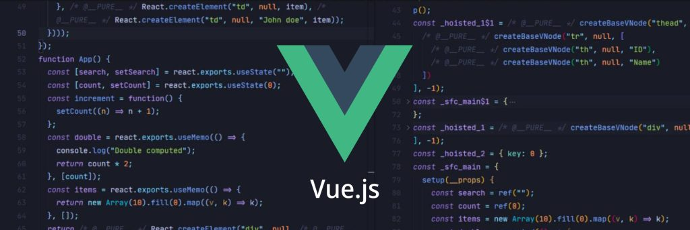
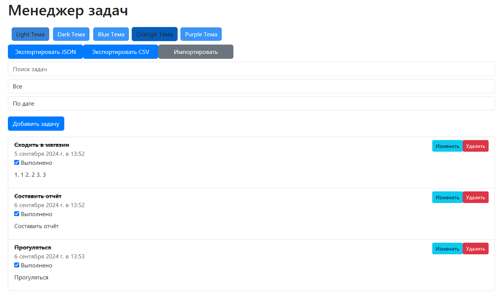
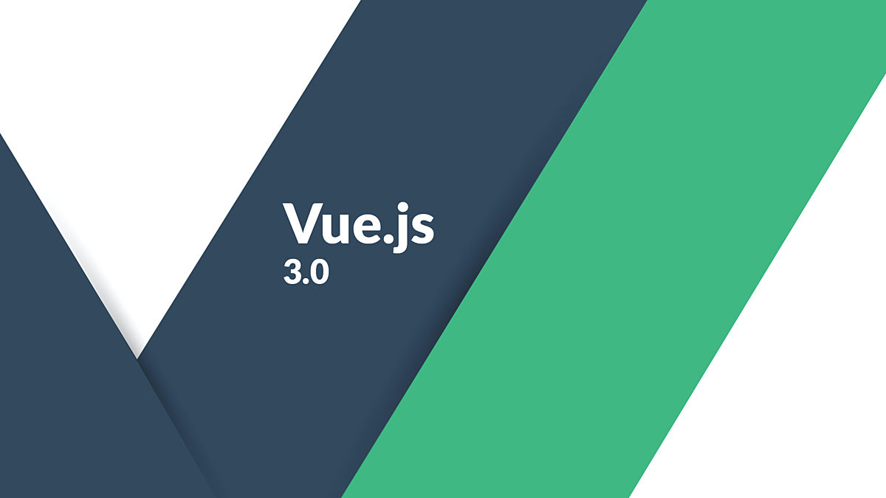
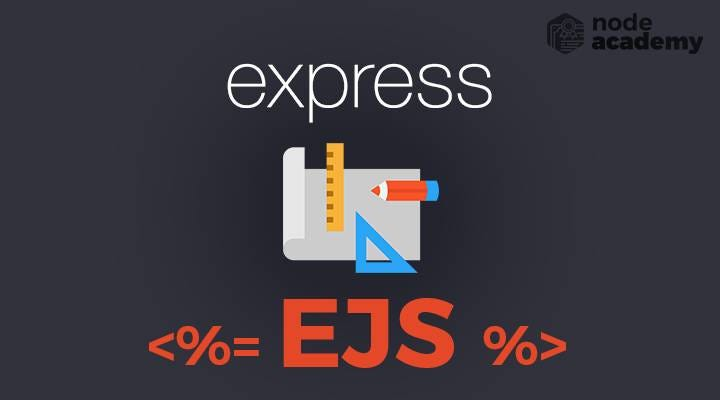
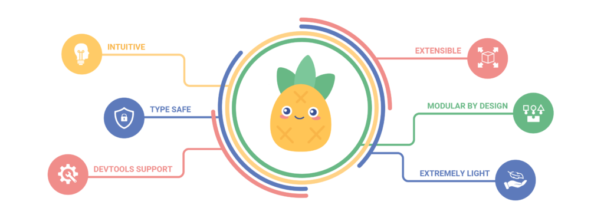

## Создание приложения Task Manager на Vue.JS (Front-end)

### Описание

**Task Manager** — это веб-приложение для управления задачами, созданное с использованием Vue.js и Bootstrap.

Приложение позволяет пользователям легко добавлять, редактировать, удалять и отслеживать выполнение задач.

Оно также поддерживает импорт и экспорт задач в форматах JSON и CSV, что упрощает резервное копирование и перенос данных.

### Возможности

1. **Добавление задач:** Пользователи могут создавать новые задачи с описанием, подробным описанием и датой выполнения.

2. **Редактирование задач:** Задачи можно редактировать, включая изменение описания, подробного описания и даты выполнения.

3. **Удаление задач:** Легкое удаление задач из списка.

4. **Отметка задач как выполненных:** Возможность отмечать задачи как выполненные с помощью чекбокса.

5. **Фильтрация и сортировка задач:** Фильтрация задач по статусу и сортировка по дате выполнения.

6. **Импорт и экспорт задач:** Поддержка импорта и экспорта задач в форматах JSON и CSV.

7. **Поддержка нескольких тем оформления:** Включает светлую, тёмную, синюю, оранжевую и фиолетовую темы.




### Использование

- **Добавление задачи:** Нажмите кнопку "Добавить задачу", введите описание, подробное описание и дату выполнения, затем нажмите "Добавить".

- **Редактирование задачи:** Нажмите кнопку "Изменить" рядом с задачей, внесите изменения и сохраните.

- **Удаление задачи:** Нажмите кнопку "Удалить" рядом с задачей.

- **Отметка как выполненной:** Отметьте чекбокс напротив задачи, чтобы отметить её как выполненную.

- **Импорт и экспорт:** Используйте кнопки "Импортировать" и "Экспортировать" для управления задачами в формате JSON или CSV.

```
Структура проекта:
task-manager/
│
├── node_modules/
│
├── archive/
│   ├── index.html
│   └── main.js
│
├── public/
│   ├── favicon.ico
│   ├── index.html
│   └── manifest.json
│
├── src
│   ├── assets/
│   │   ├── logo.png
│   │   └── themes.css
│   │
│   ├── components/
│   │   ├── AddTask.vue
│   │   ├── AddTaskModal.vue
│   │   ├── EditTaskModal.vue
│   │   ├── HelloWorld.vue
│   │   ├── TaskItem.vue
│   │   ├── TaskList.vue
│   │   └── ThemeSwitcher.vue
│   │
│   ├── App.vue
│   └── main.js
│
├── .gitignore
├── babel.config.js
├── jsconfig.json
├── package-lock.json
├── package.json
├── vue.config.js
└── README.md
```

```
`npm install -g @vue/cli` <= установка необходимых зависимостей
`vue create task-manager` <= создание проекта
`npm install bootstrap` <= установка boostrap
`npm install papaparse` <= установка papaparse (для работы .csv)

Общая установка:
`npm install bootstrap bootstrap-vue-next vue-bootstrap-icons papaparse` <= установка библиотек
```

```
Используемые технологии:
1. VUE
2. EJS
3. Boostrap: bootstrap-vue-next, vue-bootstrap-icons
4. Papaparse
5. Pinia
```







```
Vue CLI v5.0.8
? Please pick a preset: Default ([Vue 3] babel, eslint)


Vue CLI v5.0.8
✨  Creating project in C:\Users\maksi\Desktop\javascript_projects\code_samples\vue_taskmanager\task-manager.
🗃  Initializing git repository...
⚙️  Installing CLI plugins. This might take a while...


added 870 packages in 3m

100 packages are looking for funding
  run `npm fund` for details
🚀  Invoking generators...
📦  Installing additional dependencies...


added 89 packages in 19s

112 packages are looking for funding
  run `npm fund` for details
⚓  Running completion hooks...

📄  Generating README.md...

🎉  Successfully created project task-manager.
👉  Get started with the following commands:

$ `cd task-manager`
$ `npm run serve`
```

```
📖 Вам понадобятся несколько компонентов:
    ⚙️ App.vue – основной компонент приложения
    ⚙️ TaskList.vue – для отображения списка задач
    ⚙️ TaskItem.vue – для каждой задачи
    ⚙️ AddTask.vue – для добавления новой задачи
    ⚙️ AddTaskModal.vue - модальное окно для добавления новой задачи
    ⚙️ EditTaskModal.vue - модальное окно для изменения задачи
    ⚙️ ImportExport.vue - импорт/экспорт данных в форматах CSV и JSON
    ⚙️ ThemeSwitcher.vue - для изменения темы оформления
```

```
💡 Идеи для улучшения:
    1. Добавить кастомизацию для смены темы оформления (светлая, тёмная, синяя) ✅
    2. Добавить дату и время выполнения задачи ✅
    3. Определение приоритета выполнения задачи (низкий, средний, высокий / low, middle, high)
    4. Добавить возможность редактирования задачи ✅
    5. Добавить поле "Описание задачи" ✅
    6. Добавить фильтрацию и сортировку задач по статусу (выполненные/невыполненные), по дате выполнения ✅
    7. Добавить модальные окна при добавлении и редактировании задач ✅
       Это поможет организовать интерфейс и сделать его более чистым
    8. Добавление флажка для отметки задачи ✅
    9. Импорт и экспорт задач ✅
       Пользователи могут импортировать и экспортировать задачи в различных форматах, например, JSON или CSV, для удобного резервного копирования и переноса данных
    10. 
```

### Сотрудничество
Если вы хотите внести вклад в проект, пожалуйста, откройте issue или создайте pull request.

### Лицензия
Этот проект лицензирован под MIT License - подробности см. в LICENSE.

**Преподаватель:** Дуплей Максим Игоревич

**Telegram:** @QuadD4rv1n7

**Дата:** 05.09.2024
