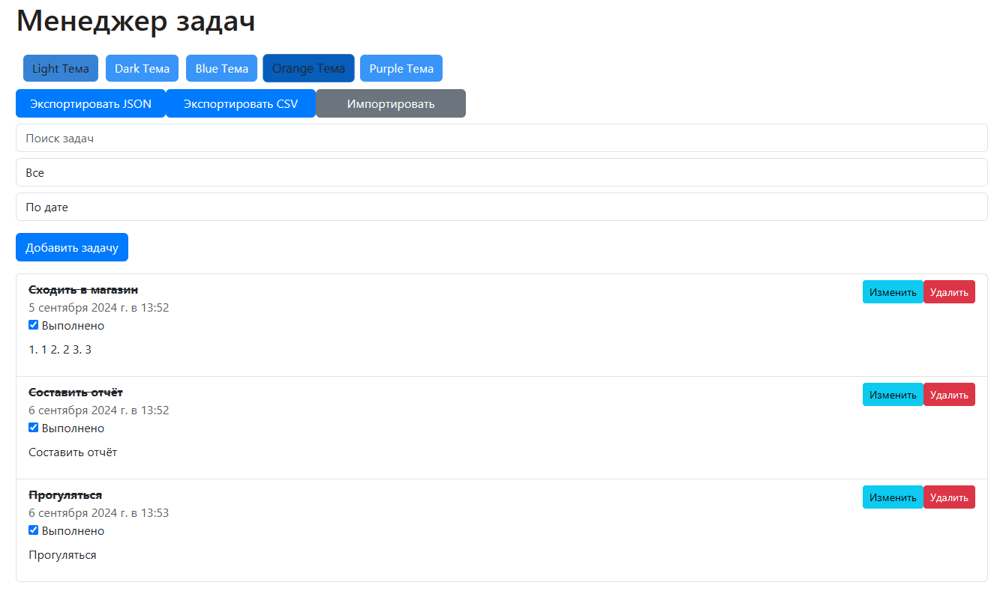

## Создание приложения Task Manager на Vue.JS (Front-end)



```
Структура проекта:
task-manager/
│
├── node_modules/
│
├── archive/
│   ├── index.html
│   └── main.js
│
├── public/
│   ├── favicon.ico
│   ├── index.html
│   └── manifest.json
│
├── src
│   ├── assets/
│   │   ├── logo.png
│   │   └── themes.css
│   │
│   ├── components/
│   │   ├── AddTask.vue
│   │   ├── AddTaskModal.vue
│   │   ├── EditTaskModal.vue
│   │   ├── HelloWorld.vue
│   │   ├── TaskItem.vue
│   │   ├── TaskList.vue
│   │   └── ThemeSwitcher.vue
│   │
│   ├── App.vue
│   └── main.js
│
├── .gitignore
├── babel.config.js
├── jsconfig.json
├── package-lock.json
├── package.json
├── vue.config.js
└── README.md
```

```
npm install -g @vue/cli <= установка необходимых зависимостей
vue create task-manager <= создание проекта
npm install bootstrap <= установка boostrap
npm install papaparse <= установка papaparse (для работы .csv)

Общая установка:
npm install bootstrap bootstrap-vue-next vue-bootstrap-icons papaparse <= установка библиотек
```

```
Vue CLI v5.0.8
? Please pick a preset: Default ([Vue 3] babel, eslint)


Vue CLI v5.0.8
✨  Creating project in C:\Users\maksi\Desktop\javascript_projects\code_samples\vue_taskmanager\task-manager.
🗃  Initializing git repository...
⚙️  Installing CLI plugins. This might take a while...


added 870 packages in 3m

100 packages are looking for funding
  run `npm fund` for details
🚀  Invoking generators...
📦  Installing additional dependencies...


added 89 packages in 19s

112 packages are looking for funding
  run `npm fund` for details
⚓  Running completion hooks...

📄  Generating README.md...

🎉  Successfully created project task-manager.
👉  Get started with the following commands:

$ cd task-manager
$ npm run serve
```

```
Вам понадобятся несколько компонентов:
    App.vue – основной компонент приложения
    TaskList.vue – для отображения списка задач
    TaskItem.vue – для каждой задачи
    AddTask.vue – для добавления новой задачи
```

```
Идеи для улучшения:
1. Добавить кастомизацию для смены темы оформления (светлая, тёмная, синяя) ✅
2. Добавить дату и время выполнения задачи ✅
3. Определение приоритета выполнения задачи (низкий, средний, высокий / low, middle, high)
4. Добавить возможность редактирования задачи ✅
5. Добавить поле "Описание задачи" ✅
6. Добавить фильтрацию и сортировку задач по статусу (выполненные/невыполненные), по дате выполнения ✅
7. Добавить модальные окна при добавлении и редактировании задач ✅
   Это поможет организовать интерфейс и сделать его более чистым
8. Добавление флажка для отметки задачи ✅
9. Импорт и экспорт задач ✅
   Пользователи могут импортировать и экспортировать задачи в различных форматах, например, JSON или CSV, для удобного резервного копирования и переноса данных
10. 
```


#### Преподаватель: Дуплей Максим Игоревич
#### Telegram: @QuadD4rv1n7
#### Дата: 05.09.2024